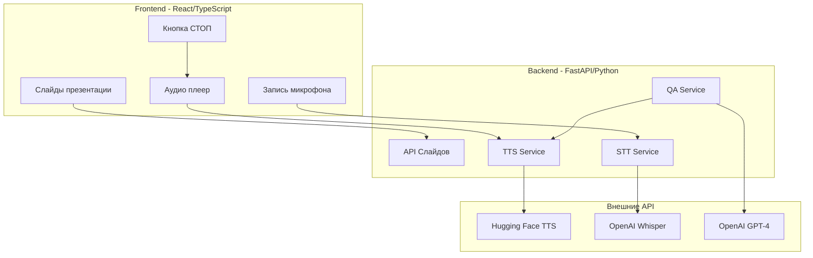
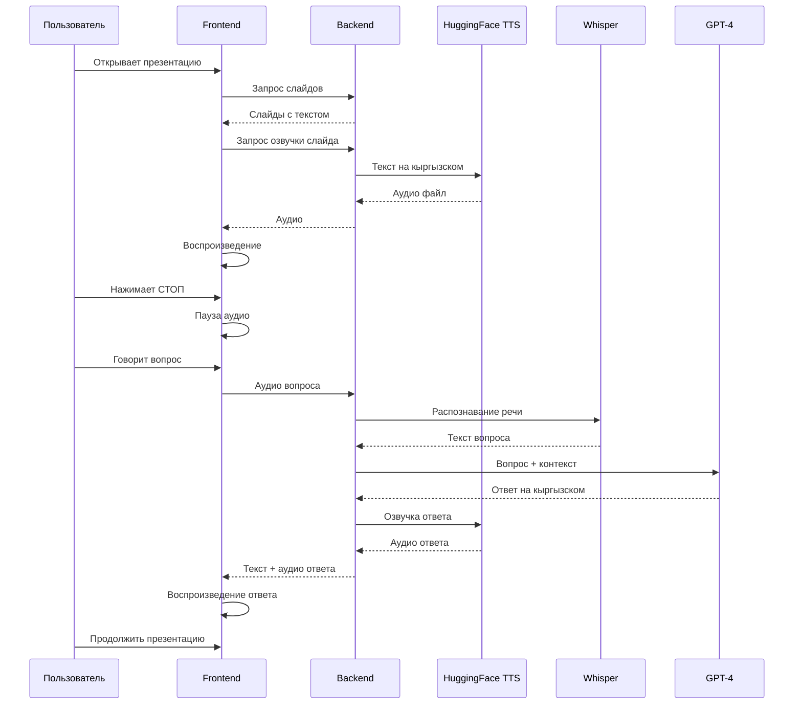

# Диаграммы архитектуры проекта

## Архитектура компонентов



## Последовательность взаимодействия



## Структура проекта

```
presentation_ruts/
├── backend/
│   ├── main.py                 # FastAPI приложение
│   ├── config.py               # Конфигурация
│   ├── routers/
│   │   ├── slides.py           # API слайдов
│   │   ├── tts.py              # Text-to-Speech
│   │   ├── stt.py              # Speech-to-Text
│   │   └── qa.py               # Вопросы и ответы
│   ├── services/
│   │   ├── huggingface_tts.py  # Hugging Face TTS
│   │   ├── whisper_stt.py      # OpenAI Whisper
│   │   └── openai_qa.py        # GPT-4 интеграция
│   ├── data/
│   │   └── slides.json         # Контент презентации
│   └── requirements.txt
├── frontend/
│   ├── src/
│   │   ├── components/
│   │   │   ├── Presentation.tsx
│   │   │   ├── Slide.tsx
│   │   │   ├── AudioPlayer.tsx
│   │   │   ├── VoiceRecorder.tsx
│   │   │   └── QAPanel.tsx
│   │   ├── hooks/
│   │   │   ├── useAudio.ts
│   │   │   └── useVoiceRecorder.ts
│   │   ├── services/
│   │   │   └── api.ts
│   │   ├── App.tsx
│   │   └── main.tsx
│   ├── package.json
│   └── vite.config.ts
├── start_backend.bat          # Скрипт запуска backend
├── start_frontend.bat         # Скрипт запуска frontend
├── start_all.bat              # Запуск всего приложения
└── README.md
```
